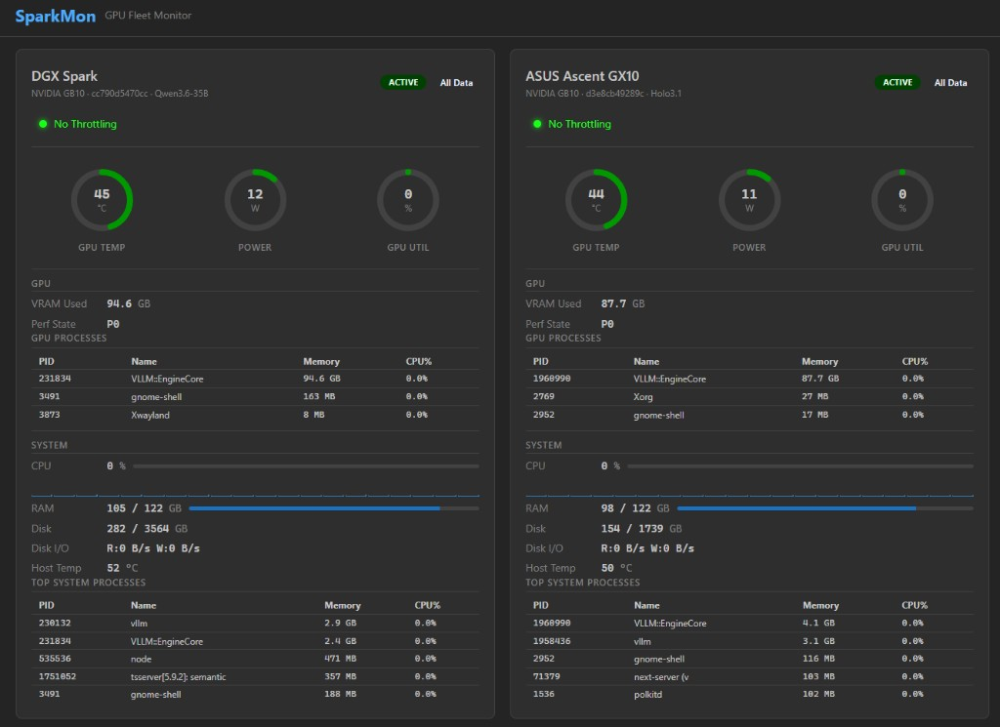

# SparkMon

Live GPU fleet monitor for NVIDIA GB10-class hardware (DGX Spark, ASUS Ascent GX10). Pure client-side React dashboard — no backend needed.



## What it does

Connects via Server-Sent Events to [`gpu-metrics-api`](https://github.com/your-org/gpu-metrics-api) instances running on each machine and displays a unified two-column dashboard with live-updating stats.

### Per-machine panel

- **Throttle status** — prominent alert when throttled, with specific bottleneck causes (thermal, power, etc.)
- **Gauges** — GPU temperature, power draw, GPU utilization (neon green / yellow / red thresholds)
- **GPU stats** — VRAM used, clock speeds (current vs max), performance state, fan speed
- **GPU processes** — PID, name, memory usage per process
- **System stats** — CPU utilization (overall + per-core), host RAM, disk usage, disk I/O rates, host temperature
- **System processes** — top 5 by memory consumption
- **All Data drawer** — full JSON tree of every field returned by the API

### GB10 hardware notes

On unified-memory GB10 hardware, VRAM `total_mb` and `free_mb` are unavailable (`0`). The dashboard shows `used_mb` as a plain counter rather than a percentage gauge. GPU utilization works correctly under active inference load.

## Data sources

| Machine | Endpoint | SSE Stream |
|---------|----------|------------|
| DGX Spark | `http://192.168.4.140:8024/gpu` | `http://192.168.4.140:8024/gpu/stream` |
| ASUS Ascent GX10 | `http://192.168.4.153:8024/gpu` | `http://192.168.4.153:8024/gpu/stream` |

Machine config lives in [`src/config.ts`](src/config.ts).

## Tech stack

- React 19 + TypeScript
- [Mantine](https://mantine.dev/) UI library (dark theme)
- Vite build
- Nginx static serving in Docker

## Development

```bash
npm install
npm run dev
```

Opens on `http://localhost:5173` with hot reload.

## Deployment

```bash
docker compose build
docker compose up -d
```

Serves on port **8095**. Deploy as a Portainer stack or standalone container.

### Docker image

Multi-stage build: `node:22-alpine` (build) → `nginx:alpine` (serve). Final image is ~30 MB.

## Configuration

Edit [`src/config.ts`](src/config.ts) to add/remove machines:

```typescript
export const MACHINES: MachineConfig[] = [
  {
    id: "spark",
    name: "DGX Spark",
    url: "http://192.168.4.140:8024",
    model: "Qwen3.6-35B",
  },
  {
    id: "ascent",
    name: "ASUS Ascent GX10",
    url: "http://192.168.4.153:8024",
    model: "Holo3.1",
  },
];
```

## MCP (agent monitoring)

An HTTP [MCP server](docs/mcp.md) exposes fleet monitoring tools for agents (Cursor, etc.) over Streamable HTTP. Tools include fleet health checks, per-machine metrics, throttle analysis, GPU process listing, and utilization comparison.

```bash
cd mcp && npm install && npm run build && npm start
```

Or deploy the `mcp/Dockerfile` container (default port **8096**). See [docs/mcp.md](docs/mcp.md) for tool descriptions and Cursor configuration.

## CORS

The `gpu-metrics-api` instances already set `allow_origins=["*"]`, so cross-origin SSE connections work without proxying.
